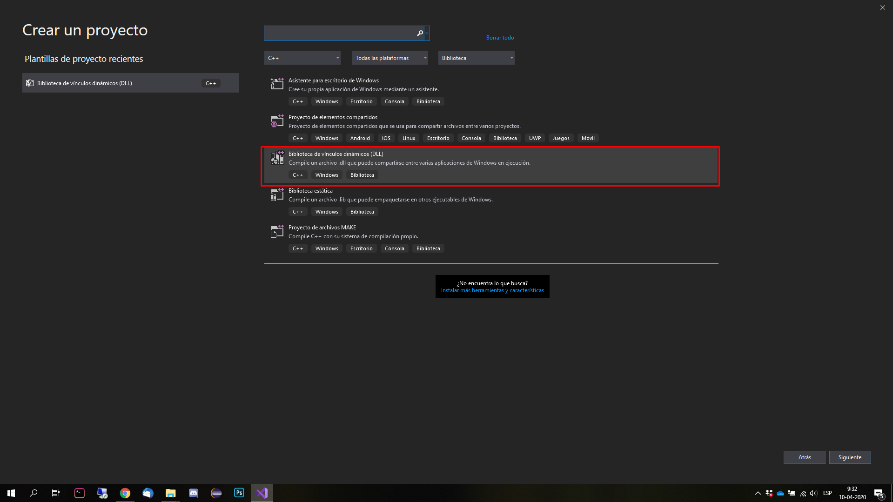
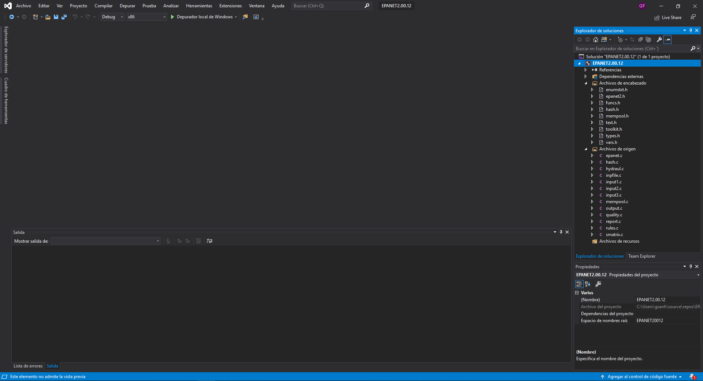
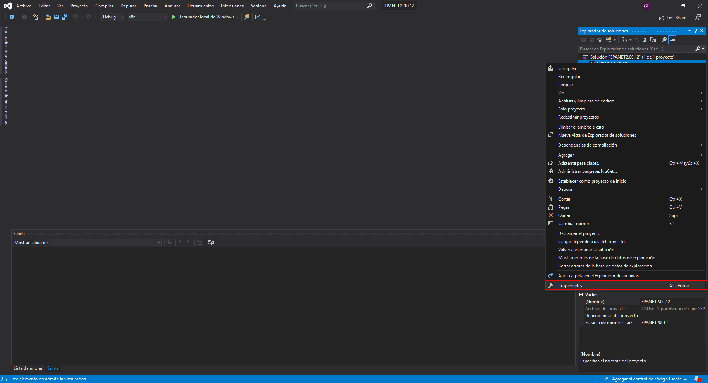
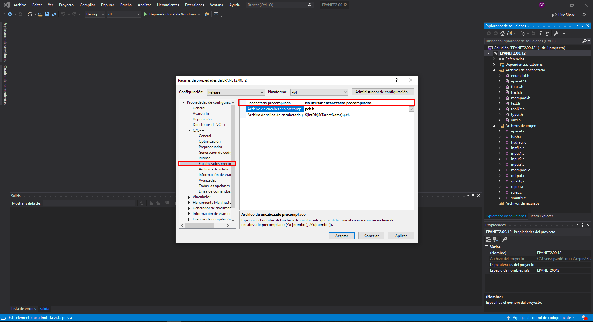
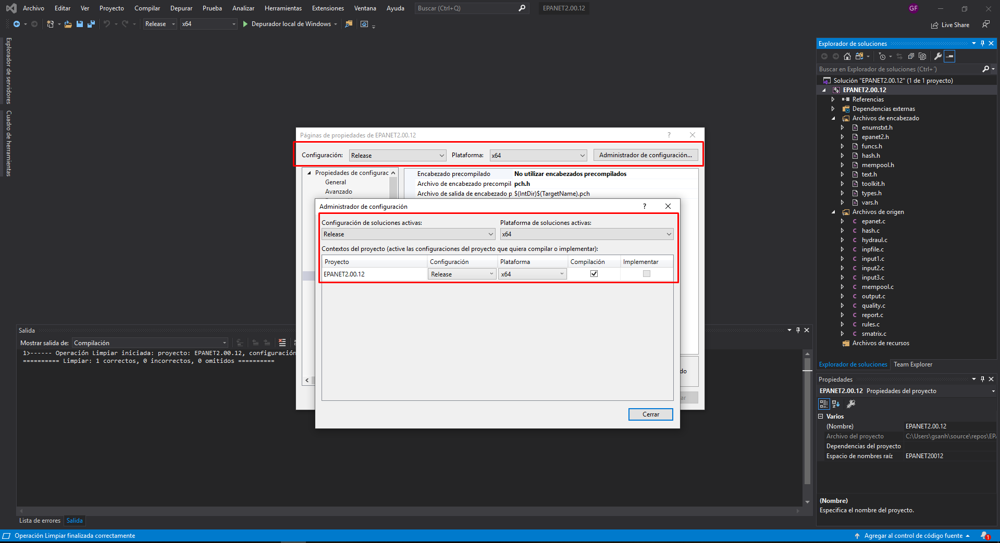
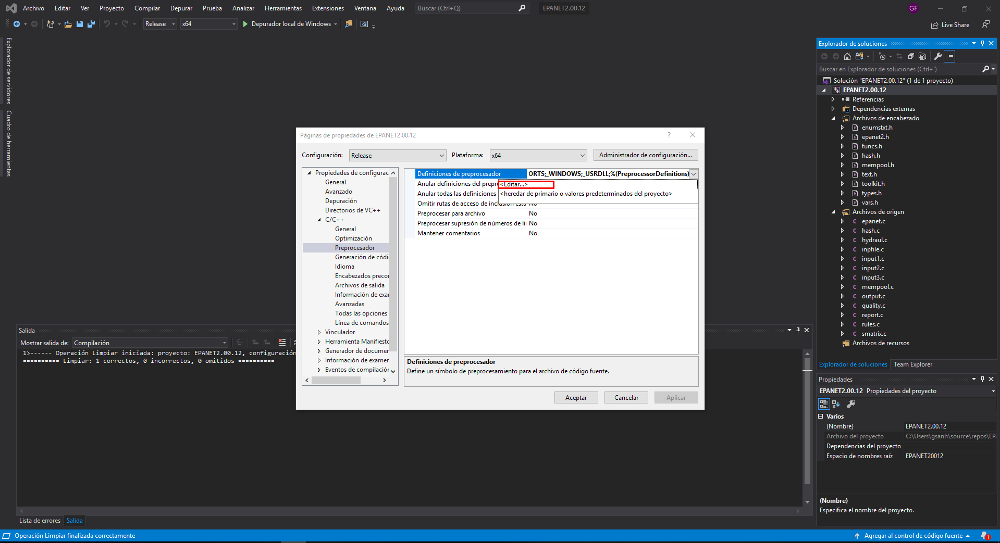
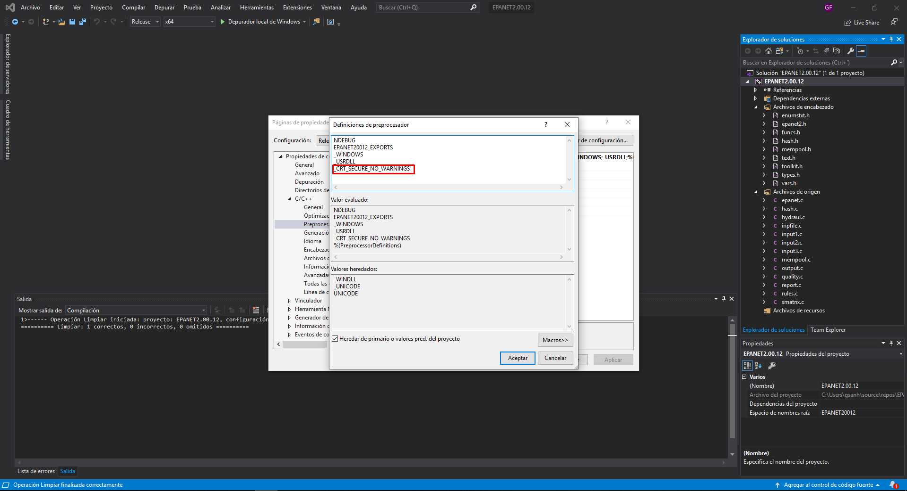
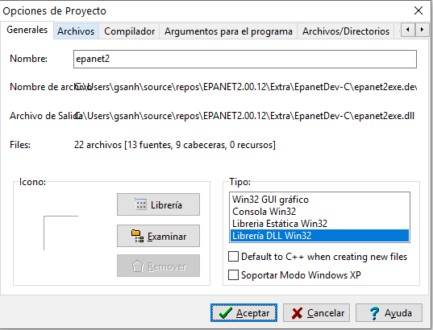
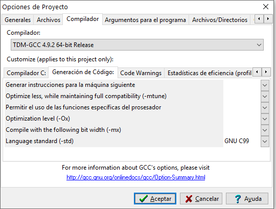

# Epanet2.0.12
Proyecto configurado para Visual Studio
Configuración para poder compilar:

CallingApp es un proyecto para probar la dll en visual studio.

## Nota
La función EnInit(saveFlag) cuando su parametro es 1 presenta un error al ser compilada por visual studio. Esto se debe a que la funcion tmpnam(), la cual permite obtener un nombre para un archivo temporal, obtiene un path a C:\Users\<username>\AppData\Local\Temp\<nombre_archivo_temporal> en dicho IDE. Puesto que EnsolveH llama internamente a EnInit() esta también se ve afectada. Es por ello que para compilar correctamente el archivo final despues de realizar las pruebas es mejor usar DEV-C.

En la carpeta Extra se incluye el mismo codigo usado por el proyecto de visual studio mas un archivo de proyecto Dev-C. Para compilar con DEV-C hay que configurar en las opciones del proyecto el Tipo Libreria DLL Win32 como se muestra en la imagen siguiente:

y en las opciones del compilador en la sección de generación de código establecer como Lenguaje estandar GNU C99 como se muestra a continuación:

